# Azure AI | Machine Learning Studio (Python - Process)

## Step 1: Create a Machine Learning Resource

To begin, we need to create a Machine Learning resource in the [Azure portal](https://azure.microsoft.com/products/machine-learning?wt.mc_id=studentamb_373747). You can refer to the notes on how to create it or reuse the resource created during **Class 2 - Introduction to Machine Learning Practice** in this repository: [Introduction - Practice of ML](https://github.com/JoseEmmanuelVG/AI-CLINIC-2-GEN---AI-Fundamentals-in-Azure-AI-900/blob/main/Intro-Study_of_ML-JEVG/2_Class_JEVG.md).

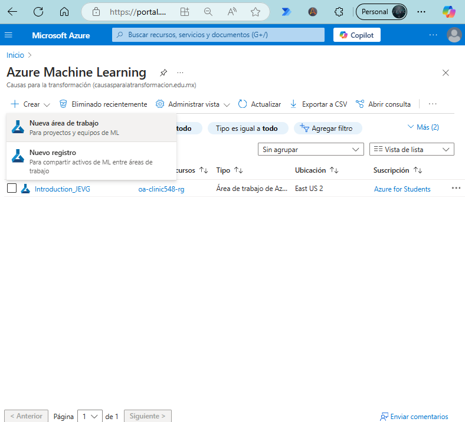

Once the workspace has been created, you can configure a compute instance to execute your Python program:

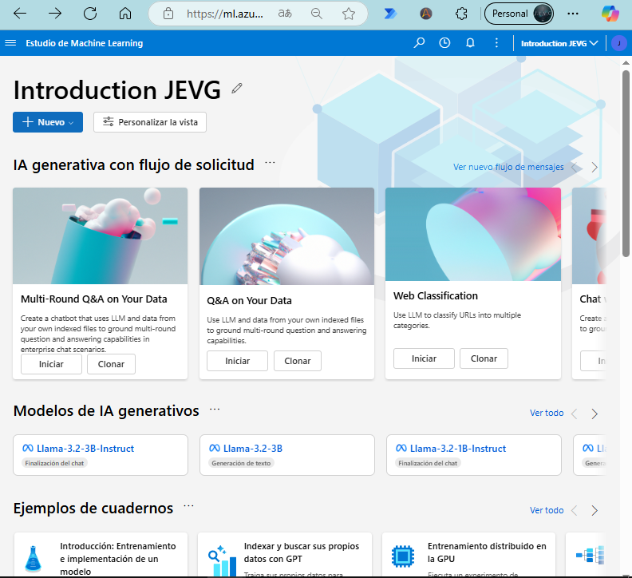

## Step 2: Introduction to Azure Machine Learning Compute Instances

Azure Machine Learning Studio provides preconfigured CPU or GPU instances for running Python notebooks, R scripts, or other Machine Learning workflows. These compute instances come with popular tools like JupyterLab, Jupyter, RStudio, ML packages, deep learning frameworks, and GPU drivers pre-installed.

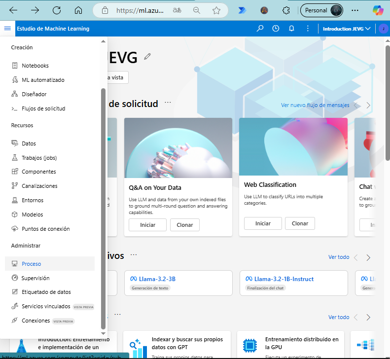

> **Note**: After completing your exercise, **ensure to stop the compute instance** to avoid unnecessary resource consumption. 

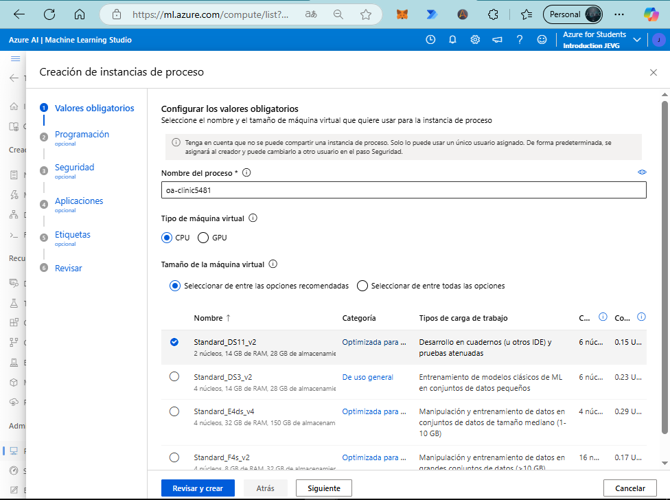
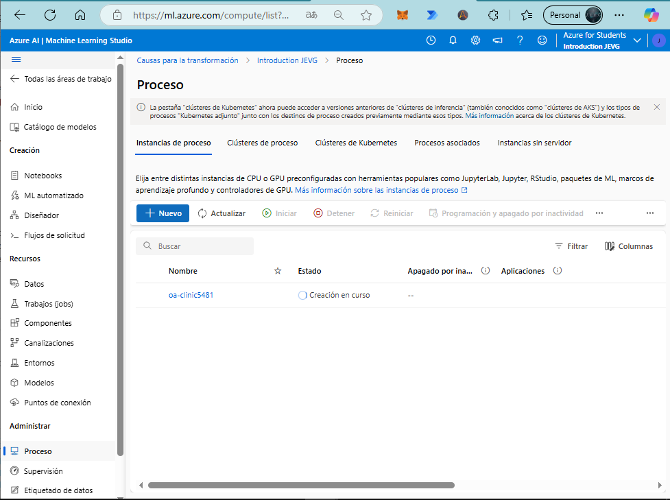

## Step 3: Access Notebooks in Machine Learning Studio

Once the compute instance is created, navigate to the **Notebooks** section within Azure Machine Learning Studio. Here, you can create a Jupyter notebook script (Python) to run on the previously configured compute instance.

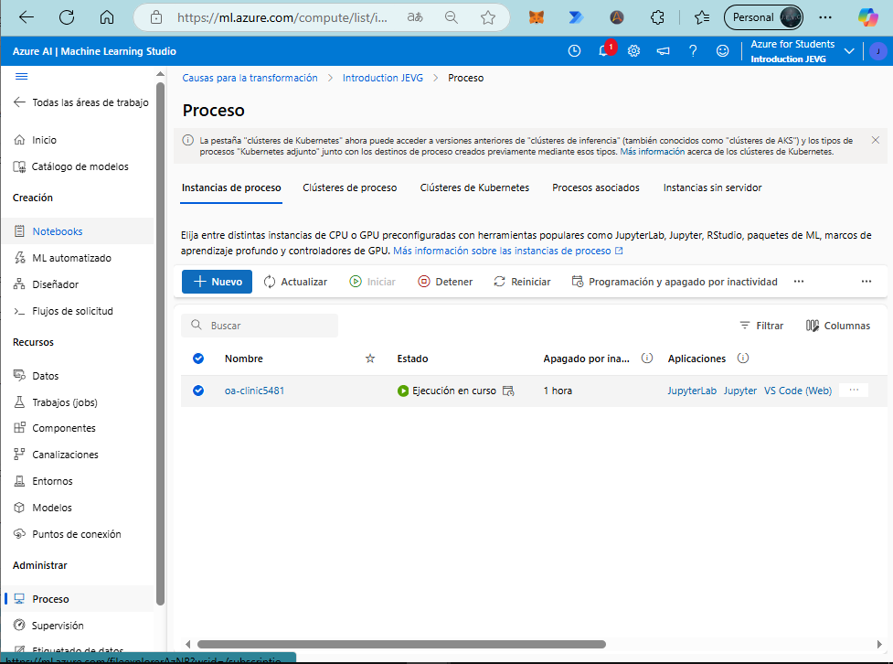
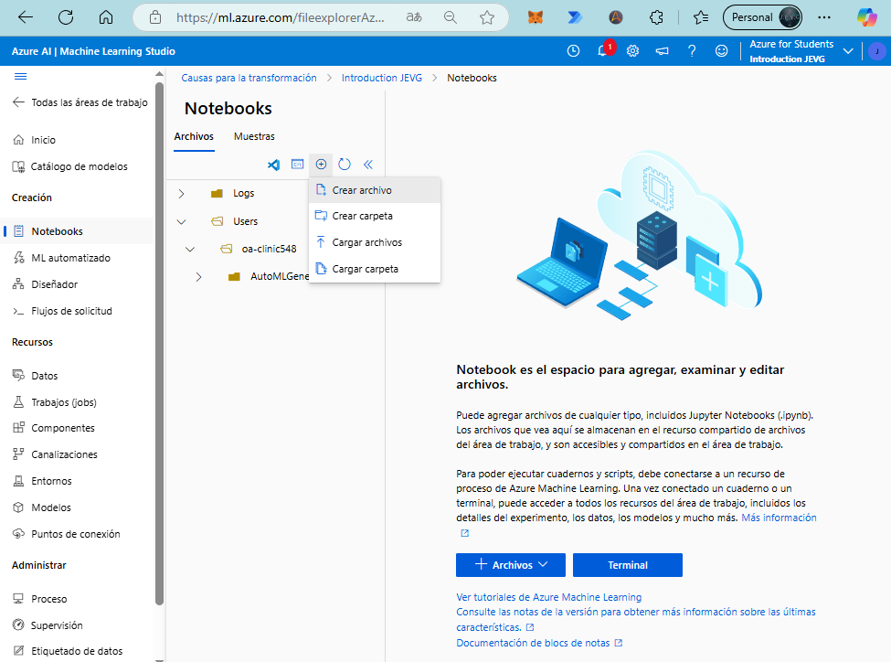
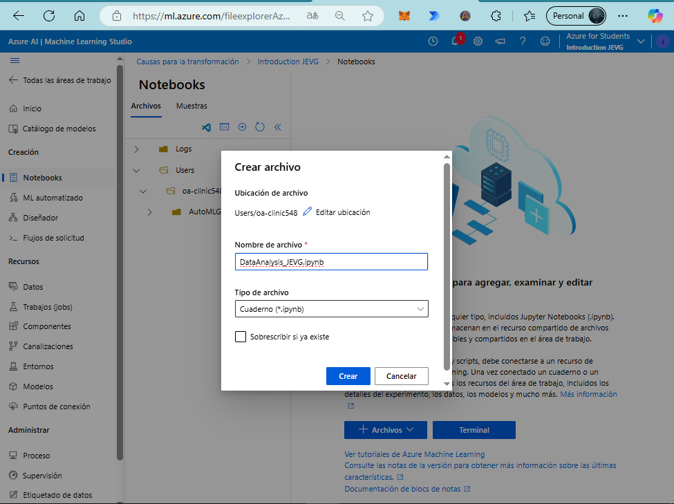

## Step 4: First Data Analysis Exercise

With the Jupyter notebook set up, you can write your script to perform your first data analysis exercise using Azure AI Machine Learning Studio.

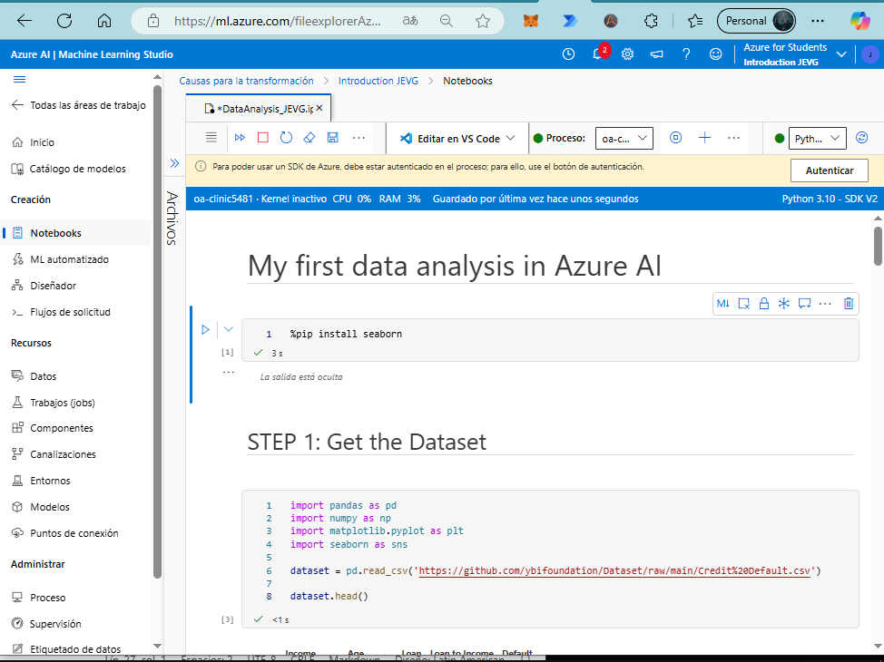

# My First Data Analysis in Azure AI

This notebook demonstrates a basic data analysis workflow using Azure AI Machine Learning Studio. The dataset used in this example is the [Credit Card Default Dataset](https://www.kaggle.com/code/ybifoundation/credit-card-default). Below is a step-by-step breakdown of the process, including code, visualizations, and insights.

The full Jupyter Notebook used for this analysis can be found in the following link:  
[Data Analysis with Azure AI ML Studio - Jupyter Notebook](https://github.com/JoseEmmanuelVG/AI-CLINIC-2-GEN---AI-Fundamentals-in-Azure-AI-900/blob/main/AzureAI_ML_Studio_Python-JEVG/DataAnalysis_JEVG.ipynb)
---

### Dataset

We will use the following dataset: [Credit Card Default](https://www.kaggle.com/code/ybifoundation/credit-card-default). Load the dataset into your notebook with the following command:

```python
default = pd.read_csv('https://github.com/ybifoundation/Dataset/raw/main/Credit%20Default.csv')
```
---
## STEP 1: Install Required Libraries and Load Dataset

### Code:
```python
%pip install seaborn

# Import necessary libraries
import pandas as pd
import numpy as np
import matplotlib.pyplot as plt
import seaborn as sns

# Load the dataset
dataset = pd.read_csv('https://github.com/ybifoundation/Dataset/raw/main/Credit%20Default.csv')

# Display the first few rows of the dataset
dataset.head()
```


<h3>Explanation:</h3><ul><li>The dataset contains information on income, age, loan amounts, loan-to-income ratios, and default status (target variable).</li><li>The <code>.head()</code> method provides a quick preview of the first five rows.</li></ul><p><strong>Dataset Sample:</strong></p><table><thead><tr><th>Income</th><th>Age</th><th>Loan</th><th>Loan to Income</th><th>Default</th></tr></thead><tbody><tr><td>66155.92510</td><td>59.017015</td><td>8106.532131</td><td>0.122537</td><td>0</td></tr><tr><td>34415.15397</td><td>48.117153</td><td>6564.745018</td><td>0.190752</td><td>0</td></tr><tr><td>57317.17006</td><td>63.108049</td><td>8020.953296</td><td>0.139940</td><td>0</td></tr><tr><td>42709.53420</td><td>45.751972</td><td>6103.642260</td><td>0.142911</td><td>0</td></tr><tr><td>66952.68885</td><td>18.584336</td><td>8770.099235</td><td>0.130990</td><td>1</td></tr></tbody></table><hr>


<h2>STEP 2: Exploratory Data Analysis (EDA)</h2>

```python
# General information about the dataset
dataset.info()
```


<h3>Output:</h3><p>The dataset consists of 2000 rows and 5 columns, with no missing values. The data types are:</p><ul><li><strong>float64</strong> for numerical columns like <code>Income</code>, <code>Age</code>, <code>Loan</code>, and <code>Loan to Income</code>.</li><li><strong>int64</strong> for the binary target variable <code>Default</code>.</li></ul><hr>


<h3>Target Variable Distribution</h3>

```python
# Count occurrences of the target variable (Default)
counter = dataset["Default"].value_counts()

# Visualize the distribution of the target variable
sns.countplot(x="Default", data=dataset)
plt.title("Targets Distribution")
plt.show()
```


<h3>Visualization:</h3><p>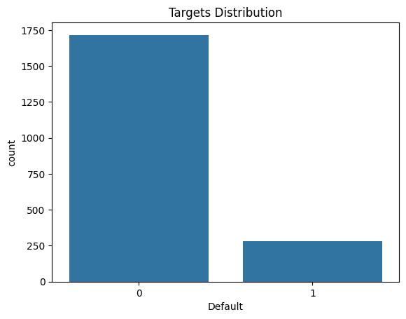</p><h3>Insights:</h3><ul><li>The target variable <code>Default</code> is imbalanced, with the majority of entries marked as <code>0</code> (no default). This imbalance may impact the model's performance and should be addressed during model training.</li></ul><hr>

<h3>Feature Analysis: Income Distribution</h3>

```python
# Analyze the distribution of income
plt.hist(dataset['Income'], bins=50)
plt.title("Income Distribution")
plt.ylabel("Quantity")
plt.xlabel("Frequency")
plt.show()
```


<h3>Visualization:</h3><p>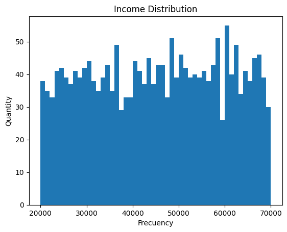</p><h3>Insights:</h3><ul><li>The <code>Income</code> feature appears to be right-skewed, with a majority of observations concentrated in the lower income ranges. Outliers with significantly higher incomes are present.</li></ul><hr>


<h3>Feature Analysis: Loan Distribution</h3>

```python
# Analyze the distribution of loan amounts
plt.hist(dataset['Loan'], bins=50)
plt.title("Loan Distribution")
plt.ylabel("Quantity")
plt.xlabel("Frequency")
plt.show()
```

<h3>Visualization:</h3><p>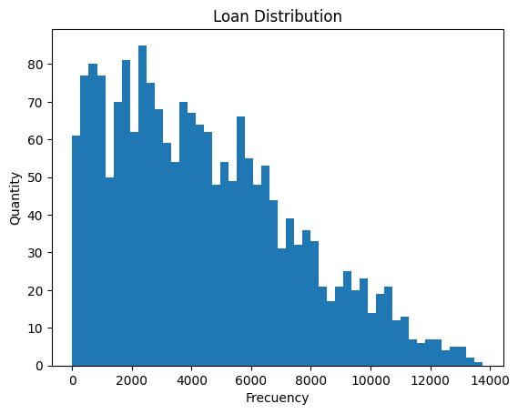</p><h3>Insights:</h3><ul><li>The <code>Loan</code> feature also appears right-skewed, with most loans in the lower range and fewer larger loans.</li></ul><hr>


<h3>Correlation Analysis</h3>

```python
# Compute the correlation matrix
corr_matrix = dataset.corr()

# Visualize the correlation matrix
plt.figure(figsize=(20, 15))
sns.heatmap(corr_matrix,
annot=True,
cmap='coolwarm')
plt.title("Correlation matrix of the variables")
plt.show()
```

<span class="hljs-comment"># Visualize the correlation matrix</span>
plt.figure(figsize=(<span class="hljs-number">20</span>, <span class="hljs-number">15</span>))
sns.heatmap(corr_matrix, 
            annot=<span class="hljs-literal">True</span>, 
            cmap=<span class="hljs-string">'coolwarm'</span>)
plt.title(<span class="hljs-string">"Correlation matrix of the variables"</span>)
plt.show()
</code>


</div></div></pre><h3>Visualization:</h3><p>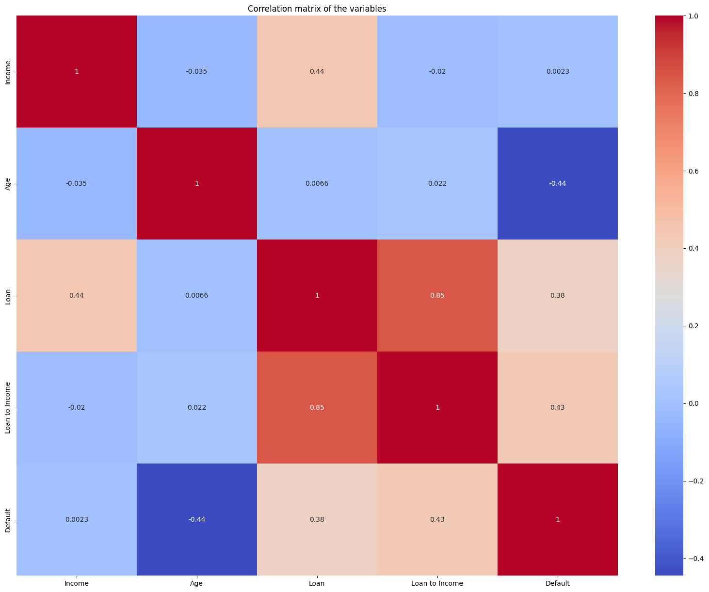</p><h3>Insights:</h3><ul><li><strong>Strong correlations</strong>:<ul><li><code>Loan to Income</code> is highly correlated with <code>Loan</code> and negatively correlated with <code>Income</code>, as expected.</li></ul></li><li><strong>Weak correlation with <code>Default</code></strong>:<ul><li>None of the features show a very strong correlation with the target variable <code>Default</code>. Feature engineering or more complex models may be required to improve predictions.</li></ul></li></ul><hr><h2>Summary of the Workflow:</h2><ol><li>Loaded and inspected the dataset.</li><li>Performed exploratory data analysis (EDA) to understand the distribution of target and feature variables.</li><li>Visualized key features and identified correlations using histograms and heatmaps.</li></ol><p>This analysis provides a solid foundation for preprocessing the data and building predictive models using Azure Machine Learning. For more details on using Azure ML, refer to the <a rel="noopener" target="_new" href="https://learn.microsoft.com/azure/machine-learning/?wt.mc_id=academic&amp;wt.mc_id=studentamb_373747" style="--streaming-animation-state: var(--batch-play-state-1); --animation-rate: var(--batch-play-rate-1);"><span style="--animation-count: 7; --streaming-animation-state: var(--batch-play-state-2);">Azure</span><span style="--animation-count: 8; --streaming-animation-state: var(--batch-play-state-2);"> Machine</span><span style="--animation-count: 9; --streaming-animation-state: var(--batch-play-state-2);"> Learning</span><span style="--animation-count: 10; --streaming-animation-state: var(--batch-play-state-2);"> documentation</span></a>.


### Thank you for coming this far


-----------


> **Contributor ID Notice**: This content includes links that track participation using my Microsoft Student Ambassador Contributor ID. By clicking these links, you contribute to engagement metrics that support the Ambassador program.


<details>
  <summary>🌟 Did you find any repository useful?</summary>
  If any project has been helpful to you, consider giving it a ⭐ star in the repository and follow my GitHub account to stay tuned for future updates! 🚀

  In addition, I am always open to suggestions, recommendations or collaborations. Feel free to [get in touch](https://www.linkedin.com/in/vazquez-galan-jose-emmanuel-664968221) if you have any questions or ideas for improving this project. I'm excited for your feedback and contributions.

  Thank you for your interest and support! 😊
</details>


<p align="center">
<a rel="license" href="http://creativecommons.org/licenses/by-nc-sa/4.0/"></a><br />This work is licensed under a <a rel="license" href="http://creativecommons.org/licenses/by-nc-sa/4.0/">Creative Commons Attribution-NonCommercial-ShareAlike 4.0 International License</a>.
</p>
