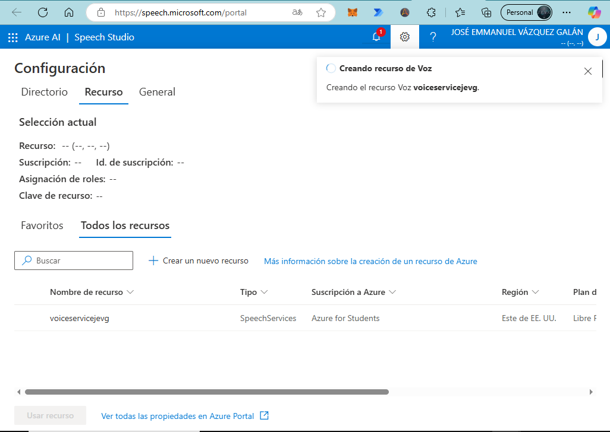
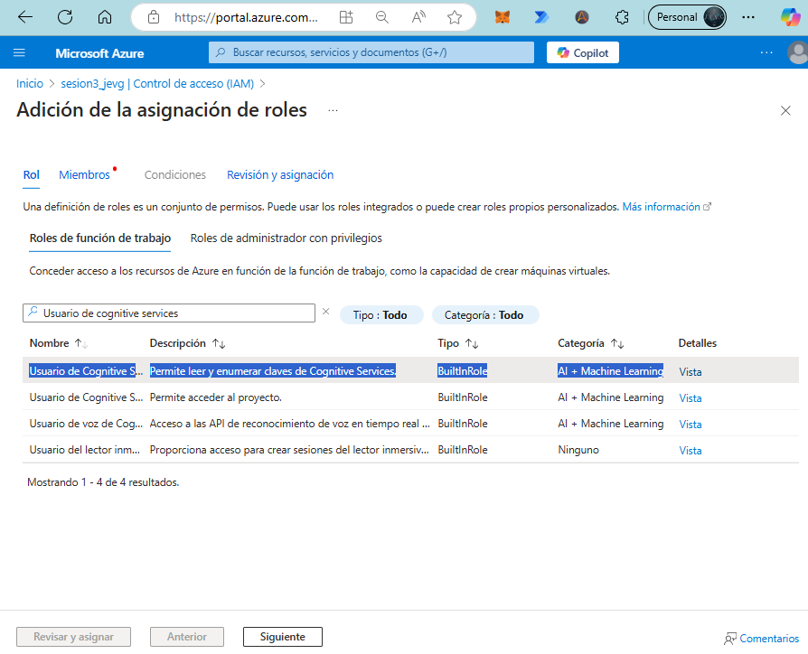
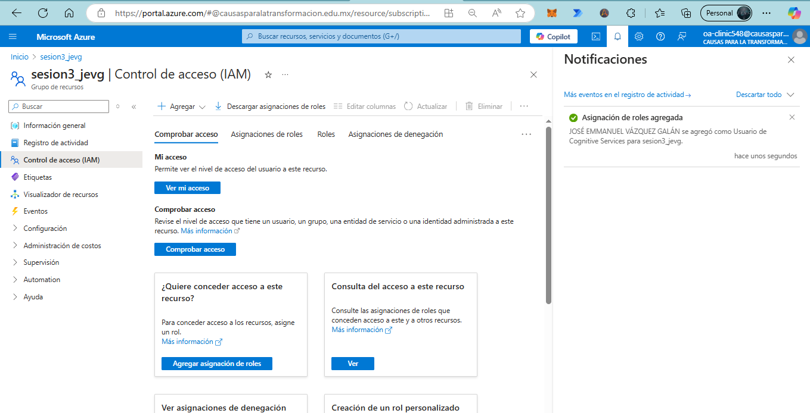

# Speech Studio in Azure AI

In this class, we will explore the Speech Studio in Azure AI, a comprehensive toolset that allows developers to integrate advanced speech capabilities into their applications. We will walk through the process of setting up the necessary resources, troubleshooting common issues, and understanding key configurations required for working with Azure's Speech Studio. 

For more detailed information, you can refer to the [Azure documentation](https://learn.microsoft.com/azure/cognitive-services/speech-service/?wt.mc_id=academic&wt.mc_id=studentamb_373747).

---

## Step 1: Sign in to the Content Safety Portal

To get started, sign in at [Content Safety Cognitive Services](https://contentsafety.cognitive.azure.com/). From here, navigate to the Speech Studio option, or you can sign in directly at [Speech Studio](https://speech.microsoft.com/).

## Step 2: Create an AI Service Resource

Proceed by creating an AI service resource. Click on the tool icon (Settings) to access the configuration options.

Fill in the required fields to set up your resource. If necessary, create a new resource by providing the required details.

### Important Naming Conventions

Follow the naming recommendations carefully. For instance, when specifying a subdomain name, avoid using underscores (`_`). The subdomain name must be a continuous string without special characters.

## Step 3: Troubleshooting Subscription Issues

If your account is managed, you may encounter the following error:

**Error**: `MissingSubscriptionRegistration. The subscription is not registered to use namespace 'Microsoft.CognitiveServices'. See https://aka.ms/rps-not-found for how to register subscriptions.`

To resolve this, grant yourself the necessary permissions in the [Azure portal](https://azure.microsoft.com/?wt.mc_id=studentamb_373747). Go to the **Subscriptions** section:

Select your active subscription, and then search for **Resource Providers** to enable or activate **Microsoft.CognitiveServices**.

Confirm that you are not registered, then proceed to register.

## Step 4: Create the Speech Resource

Once you have registered successfully, you should be able to create the Speech resource.

Refresh the page and attempt to create the resource again, confirming that creation is now allowed.

## Step 5: Verify Permissions for Using the Speech Resource

To ensure that we have permissions to use this resource (associate our account with the Speech service), we need to verify access while the resource is being created. In the [Azure portal](https://azure.microsoft.com/?wt.mc_id=studentamb_373747), navigate to **Resources**. Since we created a new resource for testing Speech Studio, we will select the newly created resource:

Choose the newly created resource:

Navigate to **Access Control (IAM)** on the left-hand options. Inside the IAM section, select **Add role assignment**:

Once in the role assignment section, search for the **Cognitive Services User** role:

Go to the **Members** section, add yourself as a member (the most efficient way is to search by the assigned email), then review and assign:

Once the role is assigned, we should be able to use the Speech resource as our account is now associated with it:

## Step 6: Testing Speech Studio Options

Now that the resource is set up, we can try some of the available options. For example, we start with **Voice Translation**.

We conducted a few tests translating from Spanish to English and from English to Spanish, achieving excellent real-time results with minimal delay:

In this section, you can also find resources such as the **Speech SDK GitHub Repository**:

[Speech SDK GitHub Repository](https://github.com/Azure-Samples/cognitive-services-speech-sdk)

And more information on the **Speech CLI** in Microsoft Learn:

[What is Speech CLI? - Microsoft Learn](https://learn.microsoft.com/azure/ai-services/speech-service/spx-overview?wt.mc_id=studentamb_373747)

## Step 7: Language Learning Applications

We can also interact with applications that can be generated with these tools, such as **Language Learning**. 

This feature provides detailed reports on areas for improvement, etc.:

## Step 8: Content Safety Studio

Another tool available is the **Content Safety Studio**. Although it is currently unavailable, it allows for content restrictions on voice, text, etc., with specific content safety policies. This tool can be useful when developing applications that must adhere to content usage terms, as it helps to detect misuse and enforce policies based on the created resource.

---

This concludes our session on setting up and using the Speech Studio in Azure AI. By completing these steps, you will have a solid understanding of how to configure, test, and troubleshoot resources within Azure's Speech services.

> **Contributor ID Notice**: This content includes links that track participation using my Microsoft Student Ambassador Contributor ID. By clicking these links, you contribute to engagement metrics that support the Ambassador program.

  
🌟 Did you find any repository useful?

  If any project has been helpful to you, consider giving it a ⭐ star in the repository and follow my GitHub account to stay tuned for future updates! 🚀

  In addition, I am always open to suggestions, recommendations or collaborations. Feel free to [get in touch](https://www.linkedin.com/in/vazquez-galan-jose-emmanuel-664968221) if you have any questions or ideas for improving this project. I'm excited for your feedback and contributions.

  Thank you for your interest and support! 😊

 This work is licensed under a <a rel="license" href="http://creativecommons.org/licenses/by-nc-sa/4.0/">Creative Commons Attribution-NonCommercial-ShareAlike 4.0 International License</a>.

