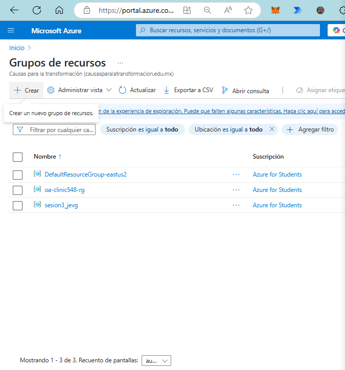
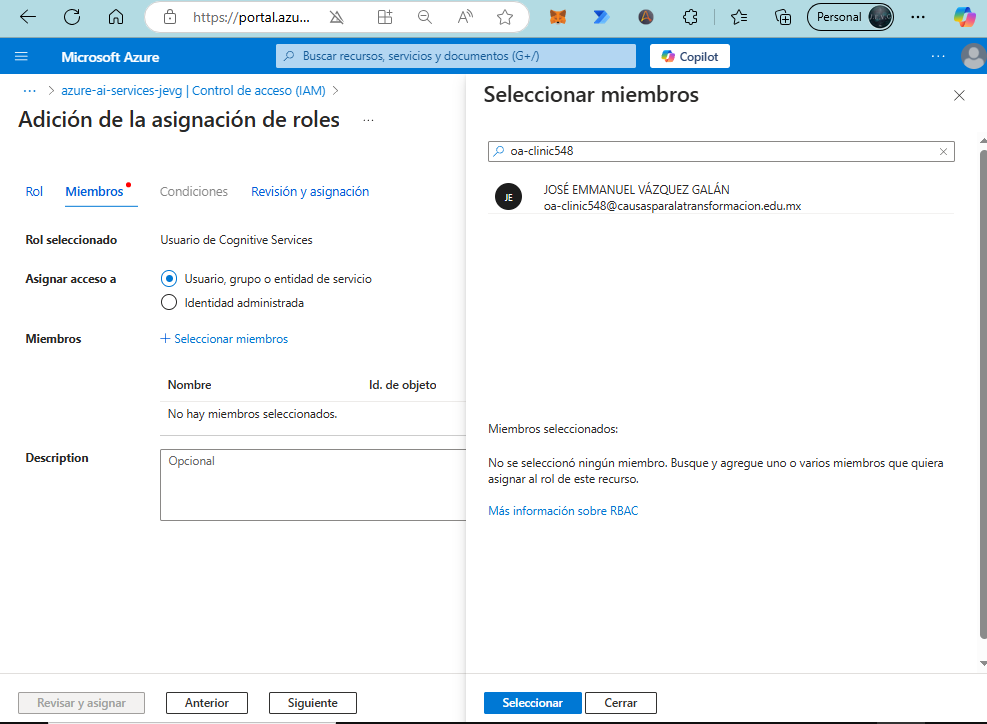
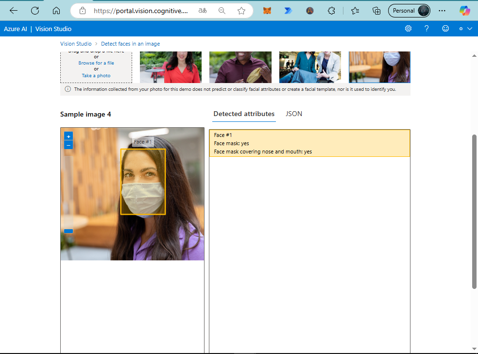

#  AI Services in Azure - Vision Studio

In this class, we will go through the steps to create a resource group in the Azure portal for managing AI services. This resource group will be foundational for organizing and managing various AI resources, such as OpenAI, Speech, Content Safety, Computer Vision, Language, and Translator services.

## Step 1: Create a Resource Group

Start by signing into the [Azure portal](https://portal.azure.com/?wt.mc_id=studentamb_373747). Navigate to **Resource groups** and select **Create** to initiate a new resource group for AI services.



Fill in the required information, such as the name of the new resource group and the region.


## Step 2: Use the Resource Group to Create an AI Service

With the resource group set up, we can now use it to organize various AI services. For example, when creating a new AI service, ensure that it is associated with the resource group we just created.


Fill in the required fields to configure the AI service and click **Create** to complete the setup.


## Step 3: Available AI Resources

With this setup, we can now work with multiple AI services under the same resource group. Available services include OpenAI, Speech, Content Safety, Computer Vision, Language, and Translator, among others.


## Step 4: Assign Permissions for Cognitive Services

To use these AI services, appropriate permissions and credentials are required. As we did in **Class 3** for Speech Studio, make sure to assign the **Cognitive Services User** role to the user account. This can be done through **Access Control (IAM)** in the Azure portal.

1. Navigate to **Access Control (IAM)** in your AI service resource.
2. Select **Add role assignment**.
3. Search for **Cognitive Services User** and add the necessary members.





## Step 5: Troubleshooting Issues with Vision Studio

If you encounter issues where the Vision Studio tools do not detect the necessary resources, you may need to create a separate resource specifically for **Computer Vision**.

1. In the [Azure portal](https://portal.azure.com/?wt.mc_id=studentamb_373747), instead of going to **Azure AI Services**, navigate to **Computer Vision**.
2. Fill in the required fields to create the Computer Vision resource.

> **Note**: Some tools may require the resource to be created in specific regions. The following regions are commonly supported for Computer Vision services: East US, France Central, Korea Central, North Europe, Southeast Asia, West Europe, and West US. Ensure you select a compatible region when setting up your resource.


---
By following these steps, you’ll have a properly configured resource group and permissions for AI services within Azure, allowing for efficient management and access to tools like OpenAI, Speech, and Vision Studio. If any issues arise, creating individual resources directly for specific services like Computer Vision can help resolve them.

---

## Using the Configured Resource for Image and Video Analysis

With the resource now detected, we can proceed to utilize it for various AI-powered tasks, starting with **Image Captioning**.

### Image Captioning

The **Image Captioning** feature analyzes images and generates human-readable captions that describe the primary objects and context within the image. This functionality can be accessed through the **Image Analysis 4.0 REST API** or the client SDK, both of which leverage AI algorithms to extract visual features and produce descriptive text.


Now, we can start by adding captions to images:


This feature analyzes the images and provides a textual description of the detected elements.

> **Functionality**: Generate human-readable captions for all important objects detected in your image.


**JSON Response**:
```json
{
  "apim-request-id": "2d355acf-2f9c-471f-9fd3-a6d988f3f6f3",
  "content-length": "158",
  "content-type": "application/json; charset=utf-8",
  "modelVersion": "2023-10-01",
  "captionResult": {
    "text": "a baseball player holding a bat",
    "confidence": 0.8214315176010132
  },
  "metadata": {
    "width": 250,
    "height": 322
  }
}
```


For more information on the **Image Analysis 4.0 API**, refer to the [Azure documentation](https://learn.microsoft.com/azure/ai-services/computer-vision/concept-describe-images-40?tabs=image&wt.mc_id=studentamb_373747).


Additional resources:
- [Learn more about Image Captioning](https://learn.microsoft.com/azure/ai-services/computer-vision/concept-describe-images-40?tabs=image&wt.mc_id=studentamb_373747)
- [Language Support for Image Captions](https://learn.microsoft.com/azure/ai-services/computer-vision/language-support#image-analysis&wt.mc_id=studentamb_373747)


### Video Retrieval and Summary

The **Video Retrieval and Summary** feature combines natural language processing and computer vision techniques to analyze video content. This tool can quickly summarize the main points of a video and allows for searches within the video to find specific moments, making it easy to locate relevant content.

- **Try it Out**: Choose a video clip to see video retrieval and summary capabilities. Note that uploaded videos are stored for 48 hours for trial purposes and are then automatically deleted.

Example:
- **Locate a Frame in the Video**: Use natural language queries (e.g., "Person with pink jacket") to find specific frames.
- **Run Summary**: Modify settings, specify summary type and search terms, and rerun the summary.


### Detect Faces in an Image

The **Face Detection** tool locates one or more human faces in images and provides details on attributes such as pose, face mask status, and facial landmarks.

> Note: Not all tools are compatible with the same resources. In cases where compatibility issues arise, a new resource group specific to the **Face API** may be required.

To set up this tool, create a new **Face API** resource in the [Azure portal](https://portal.azure.com/?wt.mc_id=studentamb_373747):

1. Go to **Azure portal** and search for **Face API**.
2. Fill in the necessary fields to configure the resource.


Once set up, the Face Detection tool will be able to detect faces in images and provide analysis on facial attributes, enhancing applications that require face recognition or analysis features.


With a compatible resource now available, we can proceed to use the **Face Detection** tool.

In this configuration, the tool is set up to detect whether individuals are wearing face masks, as shown in the following images:


**JSON Response**:
```json
[
  {
    "recognitionModel": "recognition_01",
    "faceRectangle": {
      "width": 211,
      "height": 291,
      "left": 322,
      "top": 91
    },
    "faceLandmarks": {
      "pupilLeft": {
        "x": 368.5,
        "y": 202.4
      },
      "pupilRight": {
        "x": 460.1,
        "y": 210.2
      },
      "noseTip": {
        "x": 399.9,
        "y": 246.3
      },
      "mouthLeft": {
        "x": 358,
        "y": 288.5
      },
      "mouthRight": {
        "x": 457.6,
        "y": 296.7
      },
      "eyebrowLeftOuter": {
        "x": 348,
        "y": 174.9
      },
      "eyebrowLeftInner": {
        "x": 390,
        "y": 177.6
      },
      "eyeLeftOuter": {
        "x": 353.2,
        "y": 201.5
      },
      "eyeLeftTop": {
        "x": 370.2,
        "y": 198.3
      },
      "eyeLeftBottom": {
        "x": 365.9,
        "y": 204.9
      },
      "eyeLeftInner": {
        "x": 384.8,
        "y": 204.9
      },
      "eyebrowRightInner": {
        "x": 436.9,
        "y": 182.5
      },
      "eyebrowRightOuter": {
        "x": 494.1,
        "y": 193.3
      },
      "eyeRightInner": {
        "x": 443.5,
        "y": 210.2
      },
      "eyeRightTop": {
        "x": 458.2,
        "y": 204.9
      },
      "eyeRightBottom": {
        "x": 460.5,
        "y": 213.5
      },
      "eyeRightOuter": {
        "x": 478.1,
        "y": 212.1
      },
      "noseRootLeft": {
        "x": 396.5,
        "y": 208.4
      },
      "noseRootRight": {
        "x": 423.5,
        "y": 209.7
      },
      "noseLeftAlarTop": {
        "x": 382.5,
        "y": 235.1
      },
      "noseRightAlarTop": {
        "x": 430.1,
        "y": 238.6
      },
      "noseLeftAlarOutTip": {
        "x": 372.6,
        "y": 250.1
      },
      "noseRightAlarOutTip": {
        "x": 439.5,
        "y": 256.5
      },
      "upperLipTop": {
        "x": 404.5,
        "y": 283.1
      },
      "upperLipBottom": {
        "x": 401.7,
        "y": 290.1
      },
      "underLipTop": {
        "x": 399.9,
        "y": 313.5
      },
      "underLipBottom": {
        "x": 398.8,
        "y": 325.6
      }
    },
    "faceAttributes": {
      "mask": {
        "type": "noMask",
        "noseAndMouthCovered": false
      }
    }
  }
]
```

The API returns a JSON response detailing the detected faces and whether they are wearing masks.




**JSON Response**:
```json
[
  {
    "recognitionModel": "recognition_01",
    "faceRectangle": {
      "width": 225,
      "height": 331,
      "left": 445,
      "top": 108
    },
    "faceLandmarks": {
      "pupilLeft": {
        "x": 488.4,
        "y": 243
      },
      "pupilRight": {
        "x": 592.2,
        "y": 237.9
      },
      "noseTip": {
        "x": 520.2,
        "y": 303.7
      },
      "mouthLeft": {
        "x": 492.5,
        "y": 349.4
      },
      "mouthRight": {
        "x": 577.3,
        "y": 352
      },
      "eyebrowLeftOuter": {
        "x": 458.5,
        "y": 217.2
      },
      "eyebrowLeftInner": {
        "x": 503.4,
        "y": 219.2
      },
      "eyeLeftOuter": {
        "x": 470.9,
        "y": 243.3
      },
      "eyeLeftTop": {
        "x": 490,
        "y": 234.1
      },
      "eyeLeftBottom": {
        "x": 485,
        "y": 249.9
      },
      "eyeLeftInner": {
        "x": 507.7,
        "y": 244.7
      },
      "eyebrowRightInner": {
        "x": 555.7,
        "y": 217.1
      },
      "eyebrowRightOuter": {
        "x": 624.9,
        "y": 214.4
      },
      "eyeRightInner": {
        "x": 571.8,
        "y": 242
      },
      "eyeRightTop": {
        "x": 588,
        "y": 228
      },
      "eyeRightBottom": {
        "x": 593.7,
        "y": 245.4
      },
      "eyeRightOuter": {
        "x": 615.2,
        "y": 236.1
      },
      "noseRootLeft": {
        "x": 516.4,
        "y": 251.1
      },
      "noseRootRight": {
        "x": 545.4,
        "y": 248.7
      },
      "noseLeftAlarTop": {
        "x": 506,
        "y": 288.4
      },
      "noseRightAlarTop": {
        "x": 552,
        "y": 286.9
      },
      "noseLeftAlarOutTip": {
        "x": 500.2,
        "y": 308.8
      },
      "noseRightAlarOutTip": {
        "x": 561.5,
        "y": 309.9
      },
      "upperLipTop": {
        "x": 527.8,
        "y": 347.1
      },
      "upperLipBottom": {
        "x": 526,
        "y": 354.1
      },
      "underLipTop": {
        "x": 525.3,
        "y": 360.1
      },
      "underLipBottom": {
        "x": 525.6,
        "y": 373.2
      }
    },
    "faceAttributes": {
      "mask": {
        "type": "faceMask",
        "noseAndMouthCovered": true
      }
    }
  }
]
```

To implement **Detect Faces in an Image** in your own application, you can start with [sample code on GitHub](https://github.com/Azure-Samples/azure-ai-vision/tree/main/face) and deploy it using the [Face SDK](https://learn.microsoft.com/azure/ai-services/computer-vision/quickstarts-sdk/identity-client-library?tabs=windows%2Cvisual-studio&pivots=programming-language-csharp&wt.mc_id=studentamb_373747).

---

## Custom Vision Project in Azure AI

Next, we will undertake a small project using **Custom Vision** in Azure AI. To begin, go to [Custom Vision](https://www.customvision.ai/?azure-portal=true&wt.mc_id=studentamb_373747).


### Step 1: Sign In and Create a New Project

After signing in, create a new project by clicking on the **New Project** button:


To proceed, you will need to create a new resource and complete the required fields:


### Project Types and Classifiers

Custom Vision offers several project and classification types:

- **Project Types**:
  - **Classification**: Categorizes images into specified classes.
  - **Object Detection**: Identifies specific objects within images.

- **Classification Types**:
  - **Multilabel**: Allows multiple tags per image.
  - **Multiclass**: Allows only a single tag per image.


### Step 2: Upload Images for Classification

After creating the project resource, upload images to enable the selected classification process. In this example, we will use public domain images of cats and dogs for classification.


Assign tags to the images to identify them as pets, such as "Cat" or "Dog":


These tagged images serve as our training model. Additionally, upload images of other animals (e.g., birds, fish) with a **negative label**. This helps the model learn to distinguish between pets (cats and dogs) and other animals, improving its accuracy.


### Step 3: Train the Model

Once the images are uploaded and tagged, proceed to train the model. Start the training process by selecting the training option, which will use the tagged images to develop a predictive model.


The model will produce initial results, such as **Iteration 1**, which includes information about the training duration and the domain used (e.g., General [A2]).

Results:
- **Trained**: 1 minute ago with General [A2] domain.


### Step 4: Review and Retrain

After training, you can identify potential errors by testing the model with images of similar animals. For example, the model may confuse certain animals with cats or dogs. Use these examples to retrain the model and improve accuracy iteratively.


---

By following these steps, you can create a Custom Vision project that classifies images with high accuracy. Through the iterative process of uploading, tagging, training, and testing, you can develop a model that recognizes specific animals while distinguishing them from others. This workflow is highly adaptable for various image classification needs and can be integrated into broader applications.


> **Contributor ID Notice**: This content includes links that track participation using my Microsoft Student Ambassador Contributor ID. By clicking these links, you contribute to engagement metrics that support the Ambassador program.


<details>
  <summary>🌟 Did you find any repository useful?</summary>
  If any project has been helpful to you, consider giving it a ⭐ star in the repository and follow my GitHub account to stay tuned for future updates! 🚀

  In addition, I am always open to suggestions, recommendations or collaborations. Feel free to [get in touch](https://www.linkedin.com/in/vazquez-galan-jose-emmanuel-664968221) if you have any questions or ideas for improving this project. I'm excited for your feedback and contributions.

  Thank you for your interest and support! 😊
</details>


<p align="center">
<a rel="license" href="http://creativecommons.org/licenses/by-nc-sa/4.0/"></a><br />This work is licensed under a <a rel="license" href="http://creativecommons.org/licenses/by-nc-sa/4.0/">Creative Commons Attribution-NonCommercial-ShareAlike 4.0 International License</a>.
</p>
