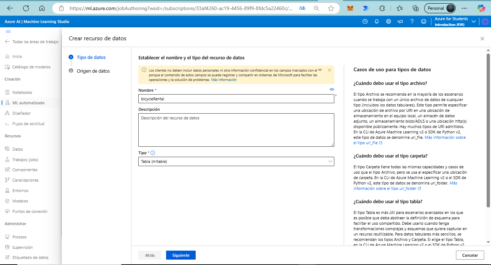

# Bike Rentals Prediction using Azure Machine Learning Studio

In this example, we will predict bike rentals based on environmental parameters using Azure Machine Learning Studio's AI tools.

## Step 1: Access Azure ML Studio

Go to [https://ml.azure.com](https://ml.azure.com) to create a workspace in Azure Machine Learning.

(To create a workspace in Azure Machine Learning, follow the guide on [Azure Machine Learning Documentation](https://learn.microsoft.com/azure/machine-learning/?wt.mc_id=studentamb_373747).) 

Fill in the required fields:

Click on "Create" and wait for the provisioning to complete.

Once completed, enter the Azure portal to view the created instance:

## Step 2: Access Automated ML

Navigate to the Automated ML section:

Create an Automated ML job by filling in the necessary fields. For this example, use the following dataset:
[Sample Data - Bike Rentals](https://aka.ms/bike-rentals)

### Dataset Sample
The dataset includes the following columns:

| day | mnth | year | season | holiday | weekday | workingday | weathersit | temp | atemp | hum | windspeed | rentals |
| --- | ---- | ---- | ------ | ------- | ------- | ---------- | ---------- | ---- | ----- | --- | --------- | ------- |
| 1   | 1    | 2011 | 1      | 0       | 6       | 0          | 2          | 0.344167 | 0.363625 | 0.805833 | 0.160446 | 331     |
| 2   | 1    | 2011 | 1      | 0       | 0       | 0          | 2          | 0.363478 | 0.353739 | 0.696087 | 0.248539 | 131     |
| 3   | 1    | 2011 | 1      | 0       | 1       | 1          | 1          | 0.196364 | 0.189405 | 0.437273 | 0.248309 | 120     |
| 4   | 1    | 2011 | 1      | 0       | 2       | 1          | 1          | 0.2      | 0.212122 | 0.590435 | 0.160296 | 108     |
| 5   | 1    | 2011 | 1      | 0       | 3       | 1          | 1          | 0.226957 | 0.22927  | 0.436957 | 0.1869   | 82      |

## Step 3: Create Regression Model

Our initial hypothesis is to use a regression model for this prediction task:

Choose "Regression" and click on "Create". Fill in the necessary settings:

## Step 4: Upload Data File

We will upload the downloaded file, so select the option for local files.

Click "Next".

Upload the data:

Verify the summary is correct, then click on "Create":

Select the created method and continue with the configuration:

### Step 5: Configure Primary Metric and Blocked Models

You can set the primary metric and blocked models according to your objective. For this case, the following settings are chosen:

It is possible to adjust limits, validations, and trials by selecting the following options:

Continue setting up the process and proceed:

Allow the training process to complete:

## Step 6: Resulting Graphs

Explore the primary features that significantly impact the model's overall predictions (also known as global explanations). Use the slider to display feature importances in descending order. All cohort feature importances are shown in parallel and can be toggled off by selecting the cohort in the legend. Click on any feature in the chart to view a density plot below, showing how the selected feature values influence the prediction.
Top 12 features by importance:

Explore the top k features that impact overall model predictions. Use the slider to display feature importances in descending order.
Top 64 features by importance:

## Step 7: Metrics Section

Navigate to the metrics section:

Here, you can delve into and analyze the resulting linear regression graph:

In a tabular format:

You can also view the residual histogram bar chart:

In a tabular format:

# Analysis of Model Performance Metrics

Based on the results obtained from the model evaluation, we can make the following observations:

## Key Performance Metrics

- **Explained Variance**: 0.7999  
  This metric indicates that approximately 79.99% of the variance in the target variable is explained by the model. A higher value indicates better performance, suggesting that the model captures a substantial amount of the variance in the data.

- **Mean Absolute Error (MAE)**: 200.8507  
  The MAE measures the average magnitude of errors between predicted and actual values, without considering direction. Here, the model's predictions deviate from actual values by an average of 200.85 units, which reflects moderate prediction accuracy.

- **Mean Absolute Percentage Error (MAPE)**: 56.17483  
  MAPE expresses the prediction error as a percentage, with this value indicating that, on average, predictions deviate by 56.17% from actual values. A lower MAPE would be preferable, suggesting the model could improve in terms of relative accuracy.

- **Median Absolute Error**: 126.1828  
  The median of absolute errors, or the typical deviation of predictions from actual values. A lower value suggests that the majority of predictions are relatively close to actual values.

- **Normalized Mean Absolute Error**: 0.0589  
  This value represents the MAE normalized by the range of the data, helping to assess the error in relation to the scale of the target variable. A lower value indicates better performance.

- **Normalized Median Absolute Error**: 0.0370  
  This normalized metric further confirms that the majority of errors are relatively small in magnitude when compared to the target range.

- **R² Score**: 0.7994  
  The R² score indicates that the model explains about 79.94% of the variance in the data, which aligns with the explained variance metric and supports that the model is a good fit.

- **Root Mean Squared Error (RMSE)**: 296.5811  
  RMSE provides a measure of error magnitude, with higher errors penalized more heavily. In this case, the RMSE suggests an average deviation of around 296.58 units from actual values.

- **Root Mean Squared Log Error (RMSLE)**: NaN  
  RMSLE could not be calculated, potentially due to zero or negative values in the target variable. This metric is often useful for data with exponential growth or skewed distributions.

- **Spearman Correlation**: 0.9173  
  This high positive Spearman correlation indicates a strong monotonic relationship between the predicted and actual values, suggesting the model maintains the order of the data well.

- **Normalized Root Mean Squared Log Error**: NaN  
  The normalized version of RMSLE is not available due to the NaN result in RMSLE.

- **Normalized Root Mean Squared Error**: 0.0870  
  This value reflects the RMSE normalized by the range of the data, allowing for a scale-independent assessment. A lower value is preferable, and this metric indicates that the model performs reasonably well given the scale of the data.

## Interval Analysis

The following images provide a breakdown of the interval-based analysis of errors and counts:
1. **Interval Extremes**:
   - Interpretation of interval breakdowns for count, average, and error metrics indicates how the model's performance varies across different ranges of the target variable.
2. **Negative Interval Extremes**:
   - This analysis of intervals with negative bounds further highlights where the model underperforms, as these regions may indicate high error or low prediction frequency.

Reviewing these intervals allows for targeted improvements, focusing on ranges with higher error rates or lower accuracy in prediction frequency.

*Images for reference*:
- predicted_true 

- residuals 

In summary, while the model performs reasonably well across several metrics, particularly in explained variance, R² score, and Spearman correlation, there is room for improvement in relative error metrics such as MAPE. Additional tuning may be needed to reduce the overall error, especially in higher or lower ranges of the target variable as shown in the interval analysis.

# Additional Project Results

## Introduction and Experiment Overview

In this project, various stages were implemented to develop a predictive model for bike rentals, utilizing Azure Machine Learning’s automated machine learning capabilities. The workflow includes key steps such as data preprocessing, feature engineering, scaling techniques, and the selection of a machine learning algorithm, all applied automatically to optimize the model's performance.

### Data Transformation Pipeline

The following diagram illustrates the data preprocessing, feature engineering, scaling techniques, and the machine learning algorithm that the automated machine learning applied to generate this model. This diagram is extracted from the data transformation section (preview view).

## Results from Secondary Jobs Section

The Secondary Jobs section provides additional insights into the model's performance and underlying configurations. This section includes various auxiliary processes that contribute to model optimization and validation.

In summary, the automated machine learning process has applied a comprehensive data pipeline and learning model to optimize predictions. Each component in this pipeline plays a role in preparing, transforming, and analyzing the data to achieve the best possible prediction outcomes.

For more information on Azure Machine Learning, visit the [Azure documentation](https://learn.microsoft.com/azure/machine-learning/?wt.mc_id=academic&wt.mc_id=studentamb_373747).

> **Contributor ID Notice**: This content includes links that track participation using my Microsoft Student Ambassador Contributor ID. By clicking these links, you contribute to engagement metrics that support the Ambassador program.

  
🌟 Did you find any repository useful?

  If any project has been helpful to you, consider giving it a ⭐ star in the repository and follow my GitHub account to stay tuned for future updates! 🚀

  In addition, I am always open to suggestions, recommendations or collaborations. Feel free to [get in touch](https://www.linkedin.com/in/vazquez-galan-jose-emmanuel-664968221) if you have any questions or ideas for improving this project. I'm excited for your feedback and contributions.

  Thank you for your interest and support! 😊

 This work is licensed under a <a rel="license" href="http://creativecommons.org/licenses/by-nc-sa/4.0/">Creative Commons Attribution-NonCommercial-ShareAlike 4.0 International License</a>.

